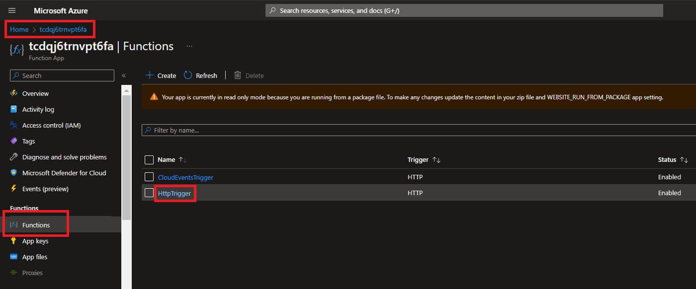
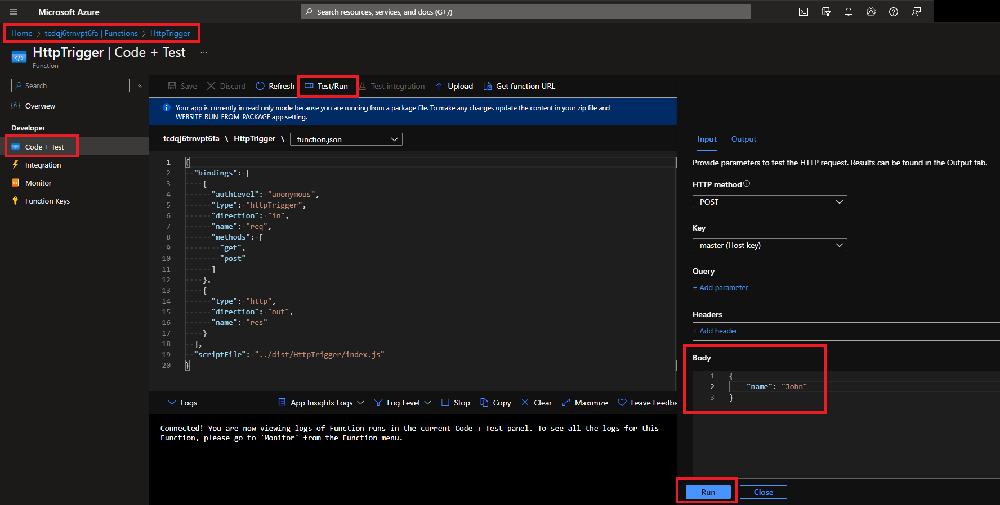
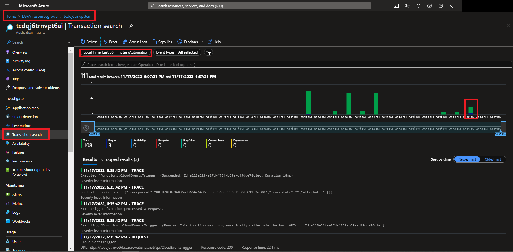
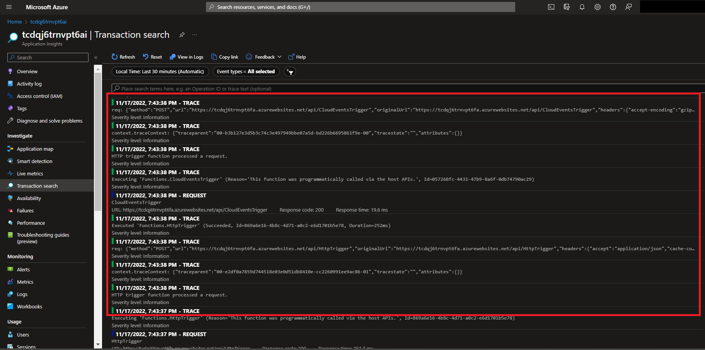
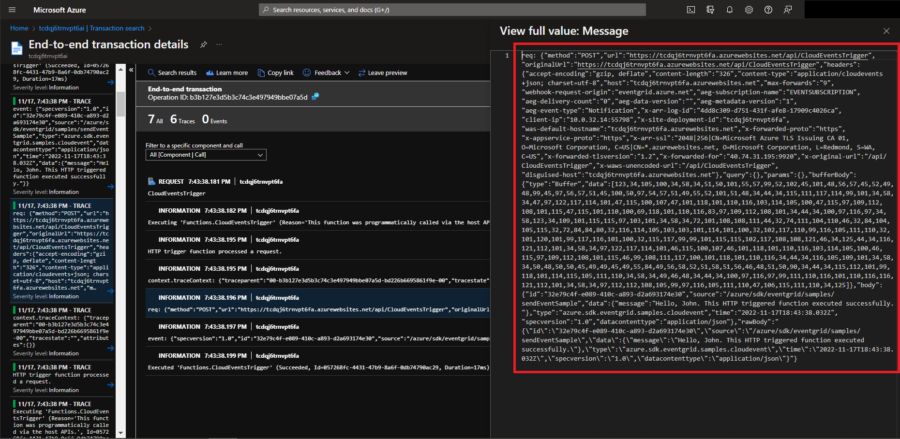

# Azure Functions - Distributed Tracing (node.js)
## Descritption
This is a sample project that tests distributed correlation in case of Azure Functions with App Insights SDK.
## How to deploy the app
### Prerequisites
- Azure CLI
- node.js
- Azure Functions Core Tools
- bash
### Deployment
- clone the repository (or save the content to a folder)
- navigate to the root of the repository
- use Azure CLI command 'az login' to sign in to your account and select your subscription
- execute deploy&#46;sh script 
## Testing

## Monitoring

## Evaluation/Issue
- the two functions (HttpTrigger and CloudEventsTrigger) have different Operation IDs and traceparents
- the traceparent/tracestate cannot be found in the event arriving to CloudEventsTrigger function in CloudEvent schema
- no correlation between the two function apps
## Resources
- https://github.com/microsoft/ApplicationInsights-node.js#azure-functions
- https://devblogs.microsoft.com/azure-sdk/distributed-tracing-with-azure-functions-event-grid-triggers/
